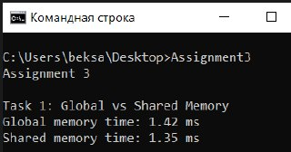
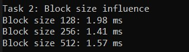
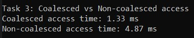
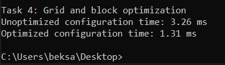

# Assignment 3

## Таск 1. Поэлементное умножение массива

В первом задании реализованы две версии программы поэлементного умножения массива размером 1 000 000 элементов. Первая версия использует исключительно глобальную память GPU. Каждый поток читает один элемент из глобальной памяти, умножает его на заданный множитель и записывает результат обратно в глобальную память. Такая реализация проста, но глобальная память медленная, поэтому время выполнения относительно велико.  

Вторая версия использует разделяемую память блока (shared memory). Каждый блок потоков сначала загружает свои элементы из глобальной памяти в локальную память блока, затем выполняет вычисления и записывает результат обратно. Использование shared memory позволяет уменьшить количество медленных обращений к глобальной памяти и ускорить выполнение программы.  

Результаты выполнения программы представлены на скриншоте:

  
  

Анализ показывает, что использование shared memory ускоряет выполнение по сравнению с глобальной памятью, особенно при больших объемах данных. Это связано с высокой скоростью доступа к shared memory по сравнению с глобальной памятью.

---

## Таск 2. Поэлементное сложение двух массивов

Во втором задании была разработана CUDA-программа для поэлементного сложения двух массивов размером 1 000 000 элементов. Основной целью исследования являлось влияние размера блока потоков на производительность. Были проведены эксперименты с блоками размером 128, 256 и 512 потоков.  

Каждый поток отвечает за обработку одного элемента массива, а количество блоков вычисляется так, чтобы все элементы были покрыты. Измерение времени выполнения показало, что слишком маленький размер блока создаёт накладные расходы на управление потоками, а слишком большой размер блока может оставить части GPU без загрузки. Оптимальный размер блока обычно кратен 32 (размер варпа), что позволяет максимально эффективно использовать ресурсы GPU.  

Результаты выполнения программы представлены на скриншоте:

  
    

Правильный выбор размера блока потоков значительно влияет на производительность CUDA-программы. Оптимальные значения минимизируют накладные расходы и загружают GPU полностью.

---

## Таск 3. Коалесцированный и некоалесцированный доступ к памяти

В третьей задаче исследуется влияние шаблона доступа к глобальной памяти на производительность. Коалесцированный доступ означает, что соседние потоки читают и пишут соседние элементы массива. Такой подход позволяет GPU объединять транзакции и ускоряет выполнение. Некоалесцированный доступ искусственно создаёт разрозненные обращения к памяти, что увеличивает количество транзакций и замедляет выполнение.  

Сравнение времени выполнения показывает, что коалесцированный доступ работает значительно быстрее, чем некоалесцированный, особенно на больших массивах. Это подчёркивает важность оптимизации паттернов доступа к памяти при разработке CUDA-программ.  

Результаты выполнения программы представлены на скриншоте:

  
  

Шаблон доступа к памяти напрямую влияет на скорость выполнения GPU-программ. Коалесцированный доступ необходим для эффективной работы.

---

## Таск 4. Оптимизация конфигурации сетки и блоков потоков

В четвёртой задаче проводится оптимизация конфигурации сетки и блоков потоков для одной из предыдущих программ, например, программы с коалесцированным доступом. Сравниваются неоптимальная конфигурация с маленькими блоками и оптимальная конфигурация с блоками размером 256 потоков и сеткой, полностью покрывающей массив.  

Измерение времени показывает, что неоптимальная конфигурация выполняется медленнее. Оптимальная конфигурация учитывает размер варпа, количество потоков на блок и полную загрузку GPU, что позволяет максимально эффективно использовать ресурсы устройства.  

Результаты выполнения программы представлены на скриншоте:

  
   

Правильная настройка сетки и блоков потоков критически важна для достижения максимальной производительности CUDA-программы.

---

## Контрольные вопросы

### 1. Какие основные типы памяти существуют в архитектуре CUDA и чем они отличаются по скорости доступа?

В CUDA существуют глобальная память, shared memory, регистры, константная и текстурная память. Глобальная память медленная, доступ к регистрам и shared memory очень быстрый. Константная память быстра для всех потоков блока.

### 2. В каких случаях использование разделяемой памяти позволяет ускорить выполнение CUDA-программы?

Когда несколько потоков блока используют одни и те же данные, загруженные из глобальной памяти. Shared memory позволяет избежать многократных обращений к медленной глобальной памяти.

### 3. Как шаблон доступа к глобальной памяти влияет на производительность GPU-программы?

Коалесцированный доступ ускоряет выполнение, некоалесцированный — замедляет, так как разрозненные обращения создают больше транзакций.

### 4. Почему одинаковый алгоритм на GPU может показывать разное время выполнения при разных способах обращения к памяти?

Из-за различий в скорости глобальной и shared памяти и различий в паттерне доступа, которые влияют на количество транзакций и загрузку варпов.

### 5. Как размер блока потоков влияет на производительность CUDA-ядра?

Он определяет количество потоков в блоке, степень загрузки GPU и накладные расходы на управление потоками. Оптимальный размер кратен 32 (варпу).

### 6. Что такое варп и почему важно учитывать его при разработке CUDA-программ?

Варп — это группа из 32 потоков, выполняемых одновременно на GPU. Эффективность исполнения зависит от того, как варпы загружаются и синхронизируются.

### 7. Какие факторы необходимо учитывать при выборе конфигурации сетки и блоков потоков?

Размер блока, количество блоков, загрузка GPU, использование памяти, размер варпа, коалесцированность доступа к памяти.

### 8. Почему оптимизация CUDA-программы часто начинается с анализа работы спамятью, а не с изменения алгоритма?

8. Оптимизация CUDA-программы часто начинается с анализа работы с памятью, потому что на GPU задержки доступа к глобальной памяти значительно превышают время вычислений. Даже оптимальный алгоритм будет медленным при неэффективном использовании памяти. Использование коалесцированного доступа, shared memory и регистров обычно даёт самый заметный прирост производительности без изменения алгоритма.

